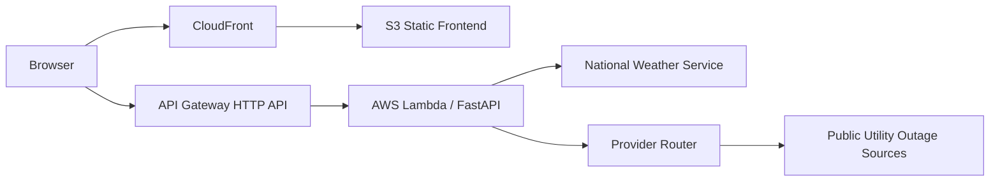

# Weather & Power Status

A serverless situational-awareness application that combines National Weather Service data with normalized electric-utility outage information behind a single FastAPI API.

This repository is the **serverless portfolio lineage** of the project. It is designed for AWS Lambda/API Gateway with a static frontend, and all committed site records are synthetic demonstration data.

## What It Does

`GET /api/status` accepts either a synthetic `site_id` or latitude/longitude coordinates and returns a normalized status response containing weather, alert, utility, and nearby outage context when the upstream provider makes that information available.

The backend separates provider-specific collection logic from the API contract so utilities with very different outage systems can be handled through the same routing layer.

## Provider Coverage

The current application includes adapters for 12 utility/provider families:

| Utility key | Provider |
| --- | --- |
| `OGE` | OG&E |
| `PSO` | Public Service Company of Oklahoma |
| `EVERGY` | Evergy |
| `ONCOR` | Oncor |
| `AUSTIN` | Austin Energy |
| `PEC` | Pedernales Electric Cooperative |
| `AEP` | AEP Texas |
| `CENTERPOINT` | CenterPoint Energy |
| `EPE` | El Paso Electric |
| `CITY_OF_CONCORDIA_ELECTRIC` | Concordia Electric |
| `PRAIRIE_LAND_ELECTRIC` | Prairie Land Electric Cooperative |
| `NINNESCAH_RURAL_ELECTRIC` | Ninnescah Rural Electric Cooperative |

Provider implementations normalize different public outage-data formats into the application's common response model. Third-party endpoints can change independently of this project, so individual integrations may require maintenance over time.

## Synthetic Demo Dataset

`app/data/sites.json` contains **synthetic portfolio records only**. The demo records preserve the application's richer site schema without publishing operational facility data, real addresses, contact numbers, or stored outage-map URLs.

Representative IDs include:

- `DEMO_OKC_01` — OGE
- `DEMO_TUL_01` — PSO
- `DEMO_KCK_01` — EVERGY
- `DEMO_DAL_01` — ONCOR
- `DEMO_AUS_01` — Austin Energy
- `DEMO_PEC_01` — PEC
- `DEMO_AEP_01` — AEP Texas
- `DEMO_CNP_01` — CenterPoint
- `DEMO_EPE_01` — El Paso Electric
- `DEMO_CEC_01` — Concordia Electric
- `DEMO_PLE_01` — Prairie Land Electric
- `DEMO_NRE_01` — Ninnescah Rural Electric

The test suite enforces coverage for all 12 canonical utility keys and verifies the synthetic-data contract.

## Architecture



### Backend

- FastAPI application
- Mangum ASGI-to-Lambda adapter
- AWS Lambda on Python 3.12
- API Gateway HTTP API
- provider router with normalized response models
- outbound hostname allowlist and concurrency controls
- provider health/cache behavior for degraded upstream conditions

### Frontend

- static HTML/CSS/JavaScript
- deployed independently to Amazon S3
- compatible with CloudFront delivery

### Deployment

`template.yaml` defines the SAM backend. The deployment workflow uses GitHub Actions and AWS OIDC rather than long-lived AWS access keys.

The current API Gateway defaults are deliberately bounded:

- throttling rate: **4 requests/second**
- throttling burst: **8 requests**
- Lambda timeout: **30 seconds**
- Lambda memory: **1024 MB**

## Security and Reliability Controls

The public lineage includes:

- latitude/longitude validation and bounded query inputs
- explicit utility/provider routing allowlists
- API Gateway throttling
- security response headers
- reduced client-facing exception leakage
- outbound hostname restrictions
- bounded outbound concurrency
- provider timeout and fallback behavior
- pinned runtime and development dependencies
- `pip-audit` in CI
- compile/import and Ruff failure checks
- synthetic-data contract tests
- publication-safety scanning for employer branding, private-key material, AWS account ARNs, and ECR registry identifiers
- EPE credential-like values excluded from source code

## Local Development

Python 3.12 is the target runtime.

```bash
python -m venv .venv
source .venv/bin/activate
python -m pip install --upgrade pip
python -m pip install -r requirements.txt -r requirements-dev.txt
PYTHONPATH=. pytest -q tests
uvicorn app.api:app --reload
```

On Windows PowerShell, activate the virtual environment with `.venv\Scripts\Activate.ps1`.

The health endpoint is available at:

```text
GET /healthz
```

## Optional El Paso Electric Configuration

The El Paso Electric adapter intentionally does **not** contain embedded credential-like defaults. If you intend to enable that provider, supply these values through the runtime environment:

```text
EPE_API_KEY
EPE_ENCRYPTION_KEY
```

`.env.example` documents the variable names with blank values. Do not commit populated `.env` files.

## Testing and CI

The non-deploying portfolio workflow runs on the finalization branch and on pull requests to `main`. It performs:

1. dependency installation
2. runtime dependency checks
3. Python compilation and targeted Ruff checks
4. the pytest suite
5. `pip-audit` with no vulnerability suppressions
6. the publication-safety scan

The production deployment workflow repeats syntax/tests/audit checks before SAM deployment.

## AWS Deployment

The repository includes an AWS SAM template and a GitHub Actions deployment workflow. To use the deployment workflow in another AWS account, provide your own repository variables/secrets for the deployment region, stack/bucket names, and OIDC roles.

High-level flow:

```text
Git push to main
    -> GitHub Actions checks
    -> AWS OIDC authentication
    -> SAM build / validate / deploy
    -> frontend sync to S3
```

No AWS account IDs, private registry locations, internal domains, or organization-specific network ranges are required by the application source.

## Design Notes

- Provider latency and availability vary during severe-weather events.
- Restoration estimates are third-party data and should be treated as advisory.
- Some provider adapters perform discovery/caching to cope with changing upstream map structures.
- The application exposes a consistent API even though upstream utilities use different technologies and data shapes.
- This serverless lineage is intentionally separate from the project's container/Kubernetes deployment lineage.

## Portfolio Focus

The project demonstrates:

- serverless API design
- FastAPI/Lambda integration
- multi-provider normalization
- defensive integration with external systems
- synthetic-data sanitization
- cloud deployment automation
- AWS OIDC-based CI/CD
- dependency and publication security gates
- operational resilience and degraded-provider handling

## License

GPL-3.0
